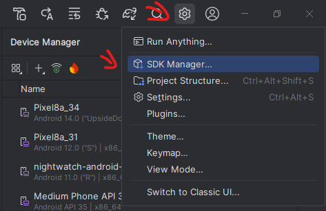
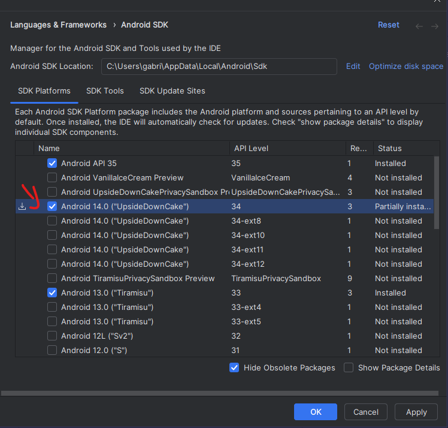
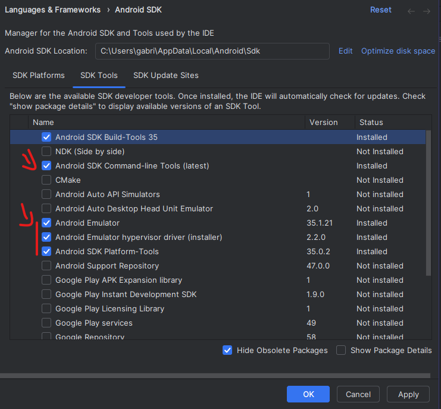
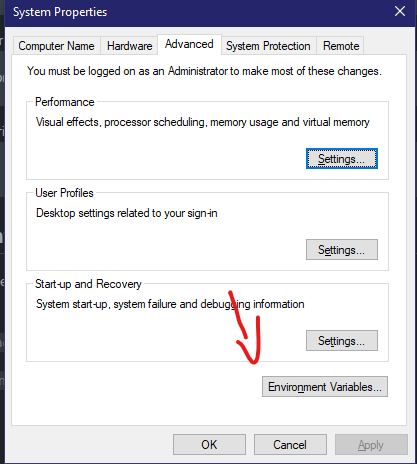
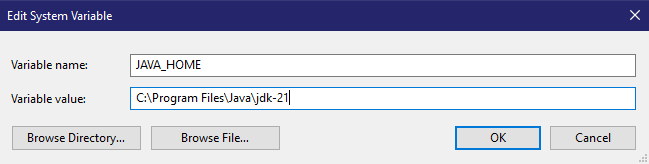
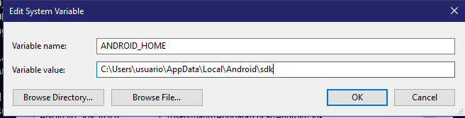
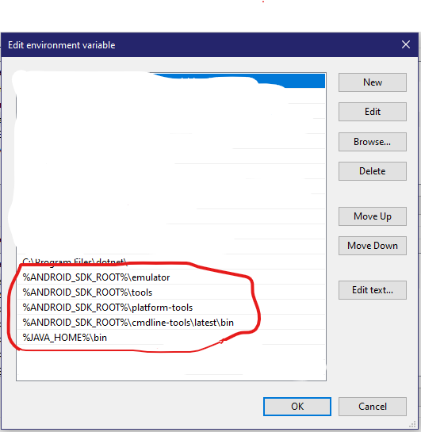
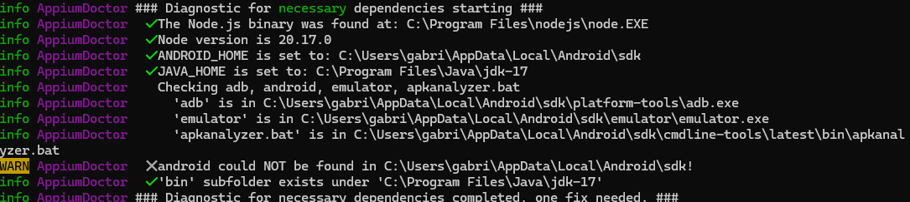

# Preparação do ambiente appium para rodar as automações

a primeira coisa que precisamos fazer, é instalar o node, para instalar o appium Cli(para rodar no terminal), em alguns videos é comum o uso da versão GUI parece mais simples, mas como é depreciado trás muitos problemas.

## Instalando o java
1. Efetuar o download da versão 21 do Java JDK: [Link de download do Java](https://www.oracle.com/java/technologies/downloads/#java21)
2. Seguir normalmente a instalação do java, e anotar o path da instalção do JDK para futuraamente
3. Verificar instalção do java:
    ```powershell
    C:\Users\usuario> java --version
    java 21.0.11 2024-04-16 LTS
    ```

## Instalando o node
1. Efetuar o download da ultima versão LTS do node: [Link de download do Node](https://nodejs.org/pt)
2. Seguir o processo normal, aceitar todas condições e marcar para instalar o chocolatey no final da instalação
3. Após instalar o node, verificar a instalção no terminal ou cmd com os comandos:
    ```powershell
    node --version
    npm --version
    ```
    devem retornar valores como o exemplo:
    ```powershell
    C:\Users\usuario> node --version
    20.17.0

    C:\Users\usuario> npm --version
    10.8.3
    ```

## Instalando o appium
1. Primeiro precisamos instalar appium no node, globalmente:
    ```powershell
    npm install -g appium
    ```
2. Após, verificar instalação do appium e certificar que está acima da versão 2.x.x:
    ```powershell
    C:\Users\usuario> appium --version
    2.11.3
    ```
3. Após instalar o appium, iremos instalar o appium-doctor para verificar a instalação do appium, ele é depreciado, mas ainda ajuda muito
    ```powershell
    npm install -g appium-doctor  
    ```
4. Execute o comando appium-doctor no terminal, para receber um relatorio sobre a instalão do appium
    ```
    appium-doctor
    ```
5. Em seguida precisamos instalar driver de automação android uiautomator2 no appium
    ```powershell
    appium driver install uiautomator2
    ```
6. Executar o comando appium para verificar se a instalação está funcionando
    ```
    appium
    ```


## Instalar android studio
1. Efetuar o download da ultima versão do Android Studio: [Link de download do Android Studio](https://developer.android.com/studio?gad_source=1&gclid=Cj0KCQjwmOm3BhC8ARIsAOSbapXeVRD4bNOHN-t-W5ITu0fpXsaQHrkIoGumtc6YPVHEvcu-dOj1rywaAlHcEALw_wcB&gclsrc=aw.ds&hl=pt-br)
2. Faça a instalação normalmente.
3. Crie um projeto qualquer para poder acessar as SDKs e Emuladores
4. Clique na engrenagem, e em SDK Manager
   

5. Baixe a ultima versão oficial do android, para evitar conflitos com o teste do app na aba de `SDK platforms`

6. Baixe  `Android SDK CLI, Android Emulator, Android SDK Platform-Tools` na aba de `SDK Tools`

7. Anote o path do SDK, para adicionar à variável path futuramente


## Setando variáveis de ambiente do android
Precisamos setar algumas váriaveis de ambiente, para o funcionamento do appium, sendo elas: `JAVA_HOME, ANDROID_HOME.`

E adicionar os caminhos na variavel PATH: `adb, emulator, apkanalyzer.`

1. Abrir variaveis do sistema: `Tecla windows > Digite "variaveis" > Clicar em Variaveis do sistema` 

2. Crie uma variável no escopo global "Variáveis do sistema": `JAVA_HOME`, `ANDROID_HOME` e `ANDROID_SDK_ROOT`

3. As variaveis `ANDROID_HOME` e `ANDROID_SDK_ROOT` tem o mesmo path como valor, que pegamos anteriormente no SDK do android

4. Na variavel path, vamos clicar em editar e adicionar as ferramentas de SDK do android


### Após setar as variáveis
Executar o comando `appium-doctor` no terminal para certificar que tudo está como o necessário, o resultado deve ser semelhante à:

caso tenha um resultado parecido a instalação está concluida
